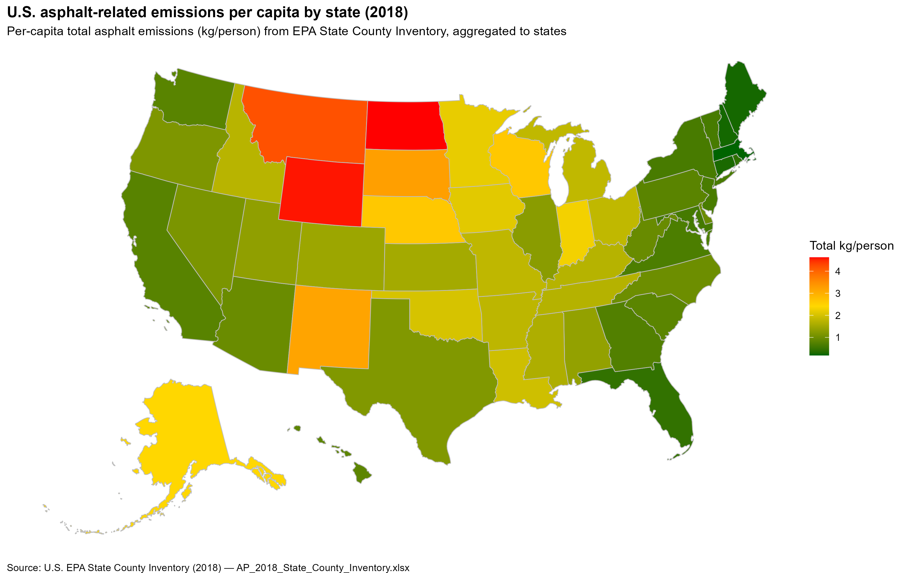

# U.S. Asphalt Emissions Choropleth (2018)

This project builds a U.S. states choropleth map of *per-capita* asphalt-related emissions using the EPA State County Inventory (2018).



## Citation

**Anthropogenic secondary organic aerosol and ozone production from asphalt-related emissions**, *Environ. Sci.: Atmos.*, 2023, 3, 1221–1230.  
DOI: <https://doi.org/10.1039/D3EA00066D>

## Files & Links

- [`asphalt_us_states_map.R`](asphalt_us_states_map.R) — main R script
- [`plan.md`](plan.md)
- [`prompt.md`](prompt.md)
- [`tasks.md`](tasks.md)
- [`walkthrough.md`](walkthrough.md)
- `.gitignore`

## Project Structure

```
.
├── asphalt_us_states_map.R
├── data/
│   └── AP_2018_State_County_Inventory.xlsx  (downloaded at runtime)
├── plots/
│   └── us_asphalt_emissions_2018.png        (created by the script)
├── plan.md
├── prompt.md
├── tasks.md
├── walkthrough.md
└── .gitignore
```

## How to run

1. Ensure you have R (≥ 4.0) and the ability to install packages.
2. From the project root, run:
   
   ```r
   source("asphalt_us_states_map.R")
   ```
   
   The script will:
   - Create `data/` and `plots/` folders if missing.
   - Conditionally download the EPA Excel file (binary mode).
   - Read the **Output - State** sheet quietly.
   - Merge with `usmap` state polygons and build the map.
   - Save `plots/us_asphalt_emissions_2018.png`.

## Notes
- Uses `pacman::p_load()` for package loading and installation.
- Paths are handled with `here::here()` so you can run from any working directory inside the project.
- Axis titles, labels, and ticks are removed for a clean map-only view.
- State borders are grey and the plot background is white.
